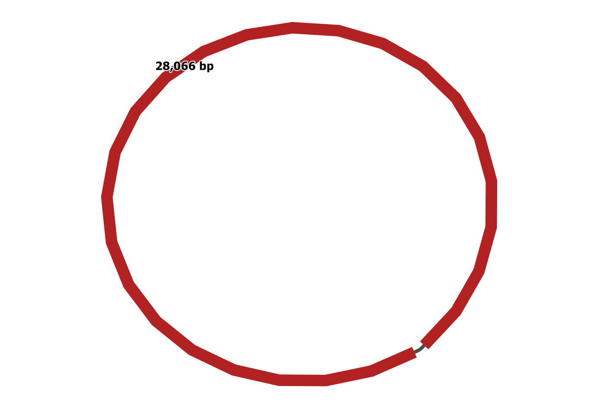
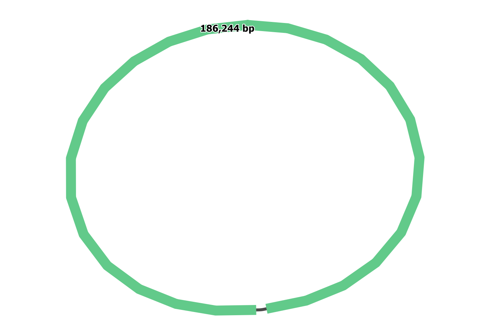
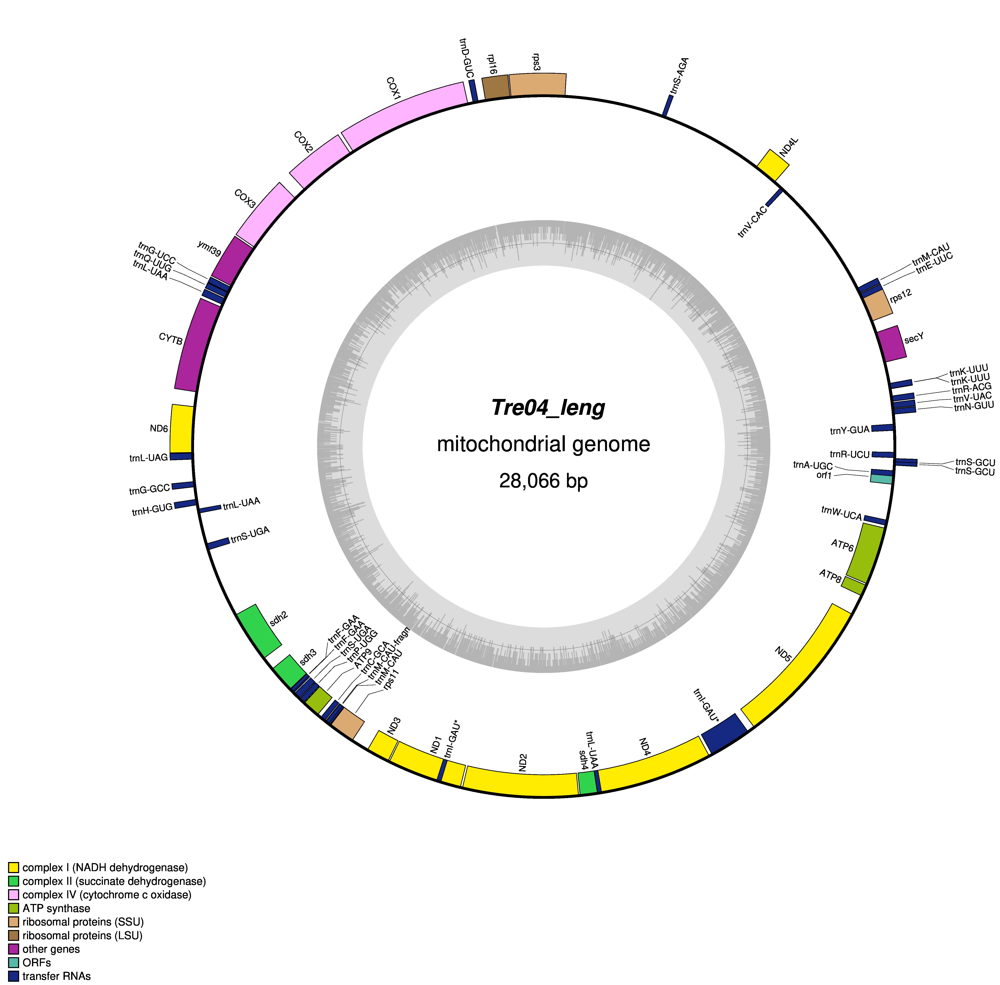
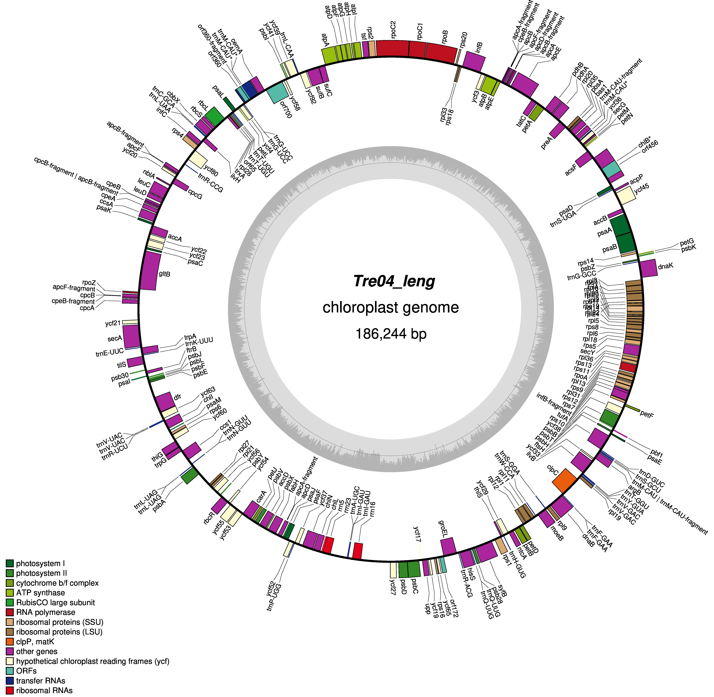

```{r setup, include=FALSE}
knitr::opts_chunk$set(collapse = TRUE)
knitr::opts_chunk$set(fig.pos = "!H", out.extra = "")
```
<div id="contents"/>


# DNA sequence data and filtering
Maerl DNA was extracted using the Qiagen Blood & Tissue Kit and sent to SNPsaurus for whole genome genotyping. Libraries were sequenced on a paired-end 2x150bp NovaSeq 6000 S4 lane. The raw reads were filtered using [Fastp](https://github.com/OpenGene/fastp). \

**Print the number of raw reads for each sample** \
This code prints the names of all fastq.fz files, calculates the number of reads per sample, and prints both the sample name and the output.
```{r, engine = "bash", eval = FALSE}
ls *fastq.gz | parallel --keep-order 'echo -n "{} "; zcat {} | \
      grep -c "^@NGS"' > rawread_counts.txt
```

**Clean raw reads using Fastp**

First, prepare a bash script called runFastp.sh that accepts a sample of paired reads and executes Fastp.
```{r, engine = "bash", eval = FALSE}
#!/bin/sh
PROC=8 
R1_FQ="$1"  
R2_FQ="$2"  
outDIR=/data2/tjenks/maerl_genomics/clean_reads  
rawDIR=/data2/tjenks/maerl_genomics/raw_reads  

fastp -i $rawDIR/${R1_FQ} -I $rawDIR/${R2_FQ} \
      -o $outDIR/${R1_FQ%_*}.fastq.gz -O $outDIR/${R2_FQ%_*}.fastq.gz \
      -q 20 --trim_poly_x --length_required 100 --thread ${PROC}
```

| Parameter | Description |
| :- | :- |
| -q 20 | base phred quality >= 20 |
| --trim_poly_x | perform both polyG (enabled by default) and polyX tail trimming |
| --length-required 100 | discard reads < 100 bp |

Second, navigate to the directory containing the raw reads and run the following code. This writes another bash script which sets up the input files for the runFastp.sh script.
```{r, engine = "bash", eval = FALSE}
paste <(ls -1 *R1_001.fastq.gz) <(ls -1 *R2_001.fastq.gz) | \ 
      awk '{print "bash runFastp.sh", $1, $2}' > ../clean_reads/clean_reads.sh
```

Finally, run the clean_reads.sh script.
```{r, engine = "bash", eval = FALSE}
bash clean_reads.sh
```

**Print the number of high quality clean read per sample**
```{r, engine = "bash", eval = FALSE}
ls *fastq.gz | parallel --keep-order 'echo -n "{} "; zcat {} | grep -c "^@NGS"' \
      > cleanread_counts.txt
```
| No. of samples | Total raw reads | Total HQ reads | % Retained |
| ---: | ---: | ---: | ---: |
| 95 | 1,158,303,200 | 1,101,098,746 | 91.5 |

[\textcolor{blue}{Back to Contents}](#contents)


# Whole genome genotyping reference assembly
A _de novo_ reference was assembled from one sample (Mor02) using [abyss-pe](https://github.com/bcgsc/abyss) using standard parameters. The contigs from the reference were run through blastn and any contigs with blast hits to bacteria or other contaminating species were removed. This step was done by the SNPsaurus team.

The output from this step was then run through the [purge_haplotigs](https://bitbucket.org/mroachawri/purge_haplotigs/src/master/) pipeline following the online [tutorial](https://bitbucket.org/mroachawri/purge_haplotigs/wiki/Tutorial) which generated the final FASTA reference (assembly_Mor02_final.fasta).


# SNP genotyping

## Align reads to reference using [bwa-mem2](https://github.com/bwa-mem2/bwa-mem2)

Index reference
```{r, engine = "bash", eval = FALSE}
bwa-mem2 index assembly_Mor02_final.fasta
```

Prepare a bash script that aligns cleaned reads to the reference using bwa-mem2
```{r, engine = "bash", eval = FALSE}
#!/bin/sh

PROC=8
R1_FQ="$1"
R2_FQ="$2"
ref=/data2/tjenks/maerl_genomics/assembly_pcal/clean_maerl_Mor02_250.fa
clean=/data2/tjenks/maerl_genomics/clean_reads

bwa-mem2 mem -t ${PROC} $ref $clean/${R1_FQ} $clean/${R2_FQ} > ${R1_FQ%_*}.sam
samtools view --threads ${PROC} -b ${R1_FQ%_*}.sam > ${R1_FQ%_*}.bam
samtools sort --threads ${PROC} ${R1_FQ%_*}.bam -o ${R1_FQ%_*}.sorted.bam
rm ${R1_FQ%_*}.sam
rm ${R1_FQ%_*}.bam
```

Navigate to the directory containing the cleaned reads and run the following command to prepare the input files
```{r, engine = "bash", eval = FALSE}
paste <(ls -1 *R1.fastq.gz) <(ls -1 *R2.fastq.gz) | \
      awk '{print "bash x_align.sh", $1, $2}' > ../12.bwa-mem2_alignments/y_input.sh
```

Execute by running `bash y_input.sh` \

**Filter alignments and generate stats**

Count and print the mapping scores for the alignments (The highest quality score from bwa-mem2 is 60)  
`samtools view input.bam | cut -f 5 | sort -n | uniq -c`

Filter alignments  
`for file in *.bam; do filename="${file%%.*}"; samtools view --threads 6 -f 0x2 -bq 30 $file > ${filename}.sorted.filt.bam; done`


Generate stats  
`for file in *.filt.bam; do filename="${file%%.*}"; samtools flagstat --threads 6 $file > ${filename}.sorted.filt.bam.stats; done`

| Parameter | Description |
| :- | :- |
| -f 0x2 | only retain alignments in which paired reads properly aligned |
| -q | only include reads with a mapping quality of 30 |
| -b | output BAM |

Count the number of mapped reads for each sample
```{r, engine = "bash", eval = FALSE}
cat *.stats | grep "mapped (" | awk '{print $1}' > reads_mapped_to_reference
```
[\textcolor{blue}{Back to Contents}](#contents)


## Call variants using [bcftools](https://samtools.github.io/bcftools/howtos/variant-calling.html)

Create alignment list file
```{r, engine = "bash", eval = FALSE}
ls -1 ../12.bwa-mem2_alignments/*.filt.bam > alignment_list
```

Run bcftools mpileup and pipe the output to bcftools call
```{r, engine = "bash", eval = FALSE}
bcftools mpileup --threads 6 --annotate FORMAT/AD,FORMAT/DP,INFO/AD -Ou -f \
      ../assembly_pcal/assembly_Mor02_final.fasta \
      --bam-list alignment_list | \
      bcftools call --threads 6 --variants-only --multiallelic-caller -Ov \
      -o variant_calls.vcf
```

Create a file containing old vcf header and new vcf headers
```{r, engine = "bash", eval = FALSE}
paste <(cat alignment_list) <(ls -1 ../12.bwa-mem2_alignments/*.filt.bam | \
      grep -o -P ".{0,5}.sorted" | sed 's/.sorted//g') > rename_samples
```

Rename vcf headers
```{r, engine = "bash", eval = FALSE}
bcftools reheader --samples rename_samples -o variant_calls.vcf.rename variant_calls.vcf
```
[\textcolor{blue}{Back to Contents}](#contents)


## Filter variants using [vcftools](https://vcftools.github.io/index.html) (_P. calcareum_ only)

**Filter 1** (remove non-_P.calcareum_ and individuals with >50% missing genotypes)
```{r, engine = "bash", eval = FALSE}
vcftools --vcf variant_calls.vcf.rename --missing-indv
cat out.imiss | sort -k 5
awk '$5 > 0.50' missingdata.imiss | cut -f 1 > ind_to_remove
vcftools --vcf variant_calls.vcf.rename --out filter1 --recode --recode-INFO-all \
      --remove ind_to_remove 
```

**Filter 2** (filter SNPs)
```{r, engine = "bash", eval = FALSE}
vcftools --vcf filter1.recode.vcf --out filter2 --recode --recode-INFO-all \
      --minQ 30 --max-missing 0.95 --minDP 8 --maxDP 100 \
      --min-alleles 2 --max-alleles 2 --remove-indels --mac 5
```

| Filter | Description |
| :- | :- |
| --minQ 30 | retain sites with a quality threshold >= 30 |
| --max-missing 0.95 | retain sites with >= 95% complete genotypes |
| --minDP 8 | retain sites with a minimum depth >= 8 |
| --maxDP 100 | retain sites with a maximum depth <= 100 |
| --min-alleles 2 --max-alleles 2 | retain biallelic sites only |
| --remove-indels | exclude indels |
| --mac 5 | retain sites with a minor allele count >= 5 |
| | |
| SNPs remaining | 19 828 |

**Filter 3** (remove SNPs in linkage disequilibrium)
```{r, engine = "bash", eval = FALSE}
vcftools --vcf filter2.recode.vcf --geno-r2 --min-r2 0.50
```

Example tabular result:

| CHR | POS1 | POS2 | N_INDV | R^2 |
| :- | -: | -: | -: | -: |
| tig_XXX | 6390 | 6399 | 66 | 1 |
| tig_YYY | 173 | 1058 | 64 | 1 | 
| tig_YYY | 173 | 2675 | 65 | 1 | 
| tig_YYY | 1058 | 2675 | 64 | 0.84 | 
| tig_..n | x | x | x | x |

Extract unique rows of POS1 (column 2) which represent one of the loci in LD to remove from the data set and redirect only the CHR and POS1 columns to a text file  
```{r, engine = "bash", eval = FALSE}
cat out.geno.ld | grep -v "^CHR" | cut -f 1,2 | uniq > loci_in_ld.txt
wc -l loci_in_ld.txt
```

Remove LD loci from data set
```{r, engine = "bash", eval = FALSE}
vcftools --vcf filter2.recode.vcf --out filter3 --recode --recode-INFO-all \
      --exclude-positions loci_in_ld.txt
```

| Filter | Description |
| :- | :- |
| --geno-r2 --min-r2 0.50 | exclude SNPs with an r2 > 0.50 |
| | |
| SNPs remaining | 15 298 |


## Filter variants using [vcftools](https://vcftools.github.io/index.html) (introgression data set)

**Extract variants among _P. calcareum_, _L. corallioides_ and _P. purpureum_**

Create a list of individuals to include in the introgression data set. I used the following individuals: Fal01, Fal02, Fal06, Fal07, Fal09, Fal10, Man03, Man04, Man21, Man24, Man28, Mil01, Man44, Mor01, Mor02, Nor01, Roc01, Roc02, Tre01, Tre03, Zar01, Zar02, and all Lcor and Sco samples.
```{r, engine = "bash", eval = FALSE}
vcftools --vcf ../variant_calls.vcf.rename --out introgression \
      --recode --recode-INFO-all --keep ind_to_keep_introgression
```

Filter variants for quality while trying to retain as many SNPs as possible
```{r, engine = "bash", eval = FALSE}
vcftools --vcf introgression.recode.vcf --recode --recode-INFO-all \
      --out introgression.filt --minQ 30 --max-missing 0.90 --minDP 3 \
      --min-alleles 2 --max-alleles 2 --remove-indels
```


| Filter | Description |
| :- | :- |
| --minQ 30 | retain sites with a quality threshold >= 30 |
| --max-missing 0.90 | retain sites with >= 90% complete genotypes |
| --minDP 3 | retain sites with a minimum depth >= 3 |
| --min-alleles 2 --max-alleles 2 | retain biallelic sites only |
| --remove-indels | exclude indels |
| | |
| SNPs remaining | 1 477 |


[\textcolor{blue}{Back to Contents}](#contents)


# Extract organelles from DNA sequence data
Extract the mitochondrial and plastid genomes from the clean reads using the programs GetOrganelle and Unicycler. For a guide to analysing NGS-derived organelles see [Song et al. (2016)](https://www.e-algae.org/journal/view.php?doi=10.4490/algae.2016.31.6.5). Each organelle extracted was compared to the NCBI GenBank database using blastn to check they matched other maerl species.

**Software**  
[GetOrganelle](https://github.com/Kinggerm/GetOrganelle) 1.6.4  
Bowtie2 2.4.1 (ensure that the path to Bowtie2 version 2.4.1 is specified because GetOrganelle failed with previous versions)  
[Unicycler](https://github.com/rrwick/Unicycler) 0.4.9b  
SPAdes 3.14.0  
BLAST+ 2.9.0  
[Bandage](https://rrwick.github.io/Bandage/)

## Mitogenome

**Download DNA sequence data to use as seeds**

| Species | GenBank ID | Organelle | Locus | Length (bp) |
| --- | --- | --- | --- | --- | 
| _P. calcareum_ | [KF808323](https://www.ncbi.nlm.nih.gov/nuccore/KF808323) | Mitochondrion | COI partial sequence | 651 |
| _Lithothamnion_ sp. | [MH281621](https://www.ncbi.nlm.nih.gov/nucleotide/MH281621.1?report=genbank&log$=nuclalign&blast_rank=1&RID=B7GM6V8X01R) | Mitochondrion | Complete genome | 25,605 |

**Extract mitogenome from one sample**  

First, extract target reads using GetOrganelle.  
```{r, engine = "bash", eval = FALSE}
get_organelle_from_reads.py -1 read1.fq.gz -2 read2.fq.gz \ 
      -o output_dir -s Lithothamnion_mitogenome.fasta,Pcalcareum_COI.fasta \
      -F embplant_mt,embplant_mt -t 8 \ 
      --which-bowtie2 /data2/tjenks/software/bowtie2-2.4.1-linux-x86_64/ \ 
      -R 50 --no-spades
```

| Parameter | Description |
| :- | :- |
| -1, -2 | forward read, reverse read  |
| -s | sequences for initial seed |
| -F | target organelle type (embplant_mt, animal_mt, fungus_mt) |
| -R 50 | maximum number of extension rounds |
| --no-spades | do not assemble reads using SPAdes |

Second, assemble the target reads using Unicycler.
```{r, engine = "bash", eval = FALSE}
unicycler -1 filtered_1_paired.fq -2 filtered_2_paired.fq -o unicycler_assembly \ 
      --mode conservative
```

Lastly, view the assembled contig graph (*.gfa) in Bandage to check for circularity and BLAST the sequence on the NCBI nucleotide database to check sequence similarity.

{ width=70% }

**Extract mitogenomes for all samples using bash script**  

First, prepare a bash script called runGetMitogenome.sh that accepts a sample of paired reads, executes GetOrganelle, and then assembles the target reads extracted from GetOrganelle using Unicycler.  

```{r, engine = "bash", eval = FALSE}
#!/bin/sh

PROC=8
R1_FQ="$1"
R2_FQ="$2"
readDIR=/data2/tjenks/maerl_genomics/clean_reads
seedDIR=/data2/tjenks/maerl_genomics/get_organelle/seed_sequences

get_organelle_from_reads.py -1 $readDIR/${R1_FQ} -2 $readDIR/${R2_FQ} -o ${R1_FQ%_*} \
      -s $seedDIR/Lithothamnion_mitogenome.fasta,$seedDIR/Pcalcareum_COI.fasta \ 
      --which-bowtie2 /data2/tjenks/software/bowtie2-2.4.1-linux-x86_64/ \
      -F embplant_mt,embplant_mt -t ${PROC} --prefix ${R1_FQ%_*} -R 50 --no-spades

cd ${R1_FQ%_*}

unicycler -1 ${R1_FQ%_*}filtered_1_paired.fq -2 ${R1_FQ%_*}filtered_2_paired.fq \ 
      -o unicycler_assembly --mode conservative
```

Second, navigate to the directory containing the clean reads and run the following code which writes another bash script that sets up the input files to runGetMitogenome.sh.
```{r, engine = "bash", eval = FALSE}
paste <(ls -1 *R1.fastq.gz) <(ls -1 *R2.fastq.gz) | \
      awk '{print "bash rungetMitogenome.sh", $1, $2}' > ../dir_path/runBash.sh
```

Finally, run the runBash.sh script.
```{r, engine = "bash", eval = FALSE}
bash runBash.sh
```

Notes: \
When the organelle genome was manually extracted from the assembly graph in Bandage (on my Windows laptop), the resulting FASTA text file was encoded in Windows. This must be changed in notepad++ to Unix (LF) for it to work with some Unix programs. \

**Rotate sequences to start at the same position**  
To rotate all sequences to start at the same position, run the program [MARS](https://github.com/lorrainea/MARS) (Multiple circular sequence Alignment using Refined Sequences) which takes a FASTA file of sequences as input. 
```{r, engine = "bash", eval = FALSE}
mars -a DNA -i input.fasta -o rotated.fasta
```

[\textcolor{blue}{Back to Contents}](#contents)

## Plastome

**Download DNA sequence data to use as seeds**

| Species | GenBank ID | Organelle | Locus | Length (bp) |
| --- | --- | --- | --- | --- | 
| _P. calcareum_ | [KC819266](https://www.ncbi.nlm.nih.gov/nuccore/KC819266) | Plastid | psbA partial sequence | 889 |
| _P. calcareum_ | [MH274809](https://www.ncbi.nlm.nih.gov/nuccore/MH274809) | Plastid | rbcL partial sequence | 1,322 |
| _Lithothamnion_ sp. | [MH281627](https://www.ncbi.nlm.nih.gov/nuccore/MH281627.1) | Plastid | Complete genome | 183,822 |

**Extract plastome from one sample**  

First, extract target reads using GetOrganelle.  
```{r, engine = "bash", eval = FALSE}
get_organelle_from_reads.py -1 read1.fq.gz -2 read2.fq.gz -o output_dir \
      -s Lithothamnion_plastome.fasta,Pcalcareum_psbA_rbcL.fasta \
      -F embplant_pt,embplant_pt -t 8 --no-spades \
      --which-bowtie2 /data2/tjenks/software/bowtie2-2.4.1-linux-x86_64/
```

| Parameter | Description |
| :- | :- |
| -1, -2 | forward read, reverse read  |
| -s | sequences for initial seed |
| -F | target organelle type (embplant_pt, animal_pt, fungus_pt) |
| --no-spades | do not assemble reads using SPAdes |

Second, assemble the target reads using Unicycler.
```{r, engine = "bash", eval = FALSE}
unicycler -1 filtered_1_paired.fq -2 filtered_2_paired.fq -o unicycler_assembly \
      --mode conservative
```

Lastly, view the assembled contig graph (*.gfa) in Bandage to check for circularity and BLAST the sequence on the NCBI nucleotide database to check sequence similarity. 

{ width=70% }

**Extract plastomes for all samples using bash script**  

First, prepare a bash script called runGetPlastome.sh that accepts a sample of paired reads, executes GetOrganelle, and then assembles the target reads using Unicycler.  
```{r, engine = "bash", eval = FALSE}
#!/bin/sh

PROC=8
R1_FQ="$1"
R2_FQ="$2"
readDIR=/data2/tjenks/maerl_genomics/clean_reads
seedDIR=/data2/tjenks/maerl_genomics/get_organelle/seed_sequences

get_organelle_from_reads.py -1 $readDIR/${R1_FQ} -2 $readDIR/${R2_FQ} -o ${R1_FQ%_*} \
      -s $seedDIR/Lithothamnion_plastome.fasta,$seedDIR/Pcalcareum_psbA_rbcL.fasta \
      -F embplant_pt,embplant_pt -t ${PROC} \
      --which-bowtie2 /data2/tjenks/software/bowtie2-2.4.1-linux-x86_64/ \
      --prefix ${R1_FQ%_*} --no-spades

cd ${R1_FQ%_*}

unicycler -1 ${R1_FQ%_*}filtered_1_paired.fq -2 ${R1_FQ%_*}filtered_2_paired.fq -o unicycler_assembly \
      --mode conservative
```

Second, navigate to the directory containing the clean reads and run the following code which writes another bash script that sets up the input files to runGetMitogenome.sh.
```{r, engine = "bash", eval = FALSE}
paste <(ls -1 *R1.fastq.gz) <(ls -1 *R2.fastq.gz) | \
      awk '{print "bash runGetMitogenome.sh", $1, $2}' > ../dir_path/runBash.sh
```

Finally, run the runBash.sh script.
```{r, engine = "bash", eval = FALSE}
bash runBash.sh
```

Notes: \
When the organelle genome was manually extracted from the assembly graph in Bandage (on my Windows laptop), the resulting FASTA text file was encoded in Windows. This must be changed in notepad++ to Unix (LF) for it to work with some Unix programs. \

**Rotate sequences to start at the same position**  
To rotate all sequences to start at the same position, run the program [MARS](https://github.com/lorrainea/MARS) (Multiple circular sequence Alignment using Refined Sequences) which takes a FASTA file of sequences as input. 
```{r, engine = "bash", eval = FALSE}
mars -a DNA -i input.fasta -o rotated.fasta
```

[\textcolor{blue}{Back to Contents}](#contents)


# Annotate organelles
After extracting an organelle contig, the organelle sequence was used as input to [GeSeq](https://chlorobox.mpimp-golm.mpg.de/geseq.html), which predicts and annotates the coding sequences (CDS) captured in the organelle assembly. For red algae mitochondria, the NCBI genetic code used for prediction and annotation appears to be [transl_table4](https://www.ncbi.nlm.nih.gov/Taxonomy/Utils/wprintgc.cgi#SG4) (The Mold, Protozoan, and Coelenterate Mitochondrial Code and the Mycoplasma/Spiroplasma Code). For red algae plastid genomes, the NCBI genetic code used for prediction and annotation appears to be [transl_table11](https://www.ncbi.nlm.nih.gov/Taxonomy/Utils/wprintgc.cgi#SG11) (The Bacterial, Archaeal and Plant Plastid Code). For a recent study on the evolutionary histories of red algal organelles see [Lee et al. 2018](https://doi.org/10.1093/gbe/evy222).

[The Genetic Code](https://www.khanacademy.org/science/biology/gene-expression-central-dogma/central-dogma-transcription/a/the-genetic-code-discovery-and-properties) -- Khan Academy

**Note**  
After examining the output of both blastn and GeSeq, I noticed that some samples had the mitogenome or plastome sequence in reverse, which explained why there were large unexplanable differences in pairwise identity between two groups of samples using the ClustalW and Mafft aligners. To get around this, I took the reverse complement of one sequence 'type' (I called this type B) and then re-annotated the reversed sequences so that the gene coding sequences were in the same direction for every sample.

## Mitogenome annotation
Mitogenome sequences were annotated using [GeSeq](https://chlorobox.mpimp-golm.mpg.de/geseq.html) and visualised using [OGDRAW](https://chlorobox.mpimp-golm.mpg.de/OGDraw.html). The _Lithothamnion sp._ GenBank record was used as a reference and The Mold, Protozoan, and Coelenterate Mitochondrial Code and the Mycoplasma/Spiroplasma Code was used for annotation. ARWEN 1.2.3 was used to annotate tRNAs. 

{ width=80% }

**Align mitochondrial CDS**

The coding sequences (CDS) output from GeSeq for each sample was imported into Geneious 6.1.8. The CDS were sorted alphabetically and concatenated to generate one sequence for each sample.

A FASTA file containing the concatenated CDS for each sample was exported and sequence alignment was conducted in Unix using Mafft following the on-screen instructions. 
```{r, engine = "bash", eval = FALSE}
module load MAFFT/7.305-foss-2018b-with-extensions 
mafft
```

Two alignments were generated: (1) Only _Phymatolithon calcareum_ samples and (2) All maerl samples. The alignments were then imported into R for tree-building.

[\textcolor{blue}{Back to Contents}](#contents)


## Plastome annotation
Plastome sequences were annotated using [GeSeq](https://chlorobox.mpimp-golm.mpg.de/geseq.html) and visualised using [OGDRAW](https://chlorobox.mpimp-golm.mpg.de/OGDraw.html). The _Lithothamnion sp._ GenBank record was used as a reference and The Bacterial, Archaeal and Plant Plastid Code and the Mycoplasma/Spiroplasma Code was used for annotation. ARAGORN 1.2.38 was used to annotate tRNAs. 

{ width=80% }

**Align plastid CDS**

The coding sequences (CDS) output from GeSeq for each sample was imported into Geneious 6.1.8. The CDS were sorted alphabetically and concatenated to generate one sequence for each sample.

A FASTA file containing the concatenated CDS for each sample was exported and sequence alignment was conducted in Unix using Mafft following the on-screen instructions. 
```{r, engine = "bash", eval = FALSE}
module load MAFFT/7.305-foss-2018b-with-extensions 
mafft
```

Two alignments were generated: (1) Only _Phymatolithon calcareum_ samples and (2) All maerl samples. The alignments were then imported into R for tree building.

[\textcolor{blue}{Back to Contents}](#contents)


